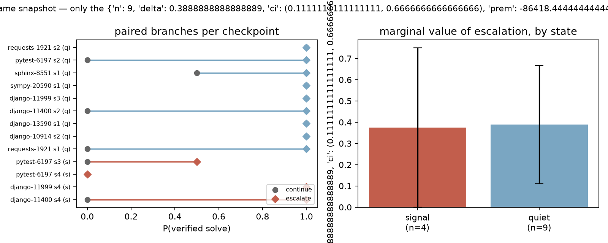
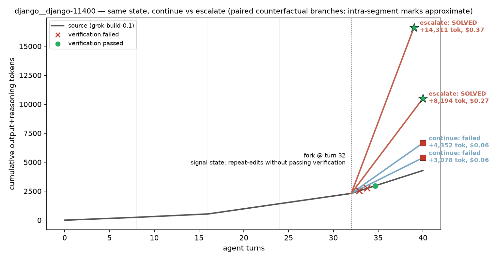
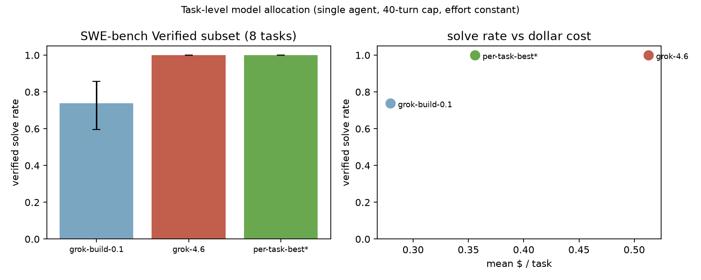
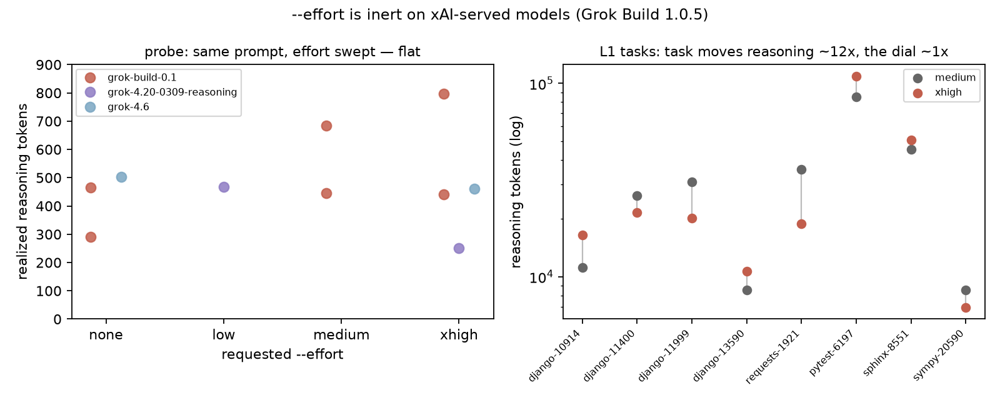

# When should a coding agent escalate to a bigger model?

Forked-trajectory measurements of marginal compute in [Grok Build](https://github.com/xai-org/grok-build), on SWE-bench Verified.

Agent harnesses expose a lot of test-time compute. This repo measures one allocation choice: take a live coding-agent run, freeze it at a checkpoint (same filesystem, same conversation, same remaining budget), then fork two branches. One **continues** on `grok-build-0.1`. The other **escalates** to `grok-4.6`. Both get graded on SWE-bench's hidden tests. The gap is what escalation bought at that state.

## Findings

- **Escalation raised P(solve) by about +0.4, and never lowered it.** Δsolve = +0.38 [0.00, +0.75] at failure-signal states, +0.39 [+0.11, +0.67] at quiet states (13 checkpoints × 2 reps/arm, 50 graded branches).
- **It rescues trajectories the base model never finishes.** django-11400 is 0/6 for `grok-build-0.1` from scratch. Escalate branches solved it 2/2 even from a deep failure state.
- **At quiet states, escalating was cheaper.** Mean token premium −86k: `grok-4.6` finishes and stops while the base model burns its whole budget.
- **Rescuing a failing trajectory costs about 347k total tokens per marginal solve.** There is also a too-late boundary: with 8 turns of budget left, even `grok-4.6` could not save it.
- **Side finding:** Grok Build's `--effort` dial is silently inert for every xAI-served model. Caught by an A/A control. Full write-up in [docs/dial-finding.md](docs/dial-finding.md).


*Paired branches from identical frozen states. Escalating to grok-4.6 raised P(solve) at both signal and quiet checkpoints and never lowered it. Bootstrap CIs over checkpoints.*

## How the measurement works

Every source trajectory is its own control. Run the base model in 8-turn segments. At each boundary, freeze the full state: filesystem via `docker commit`, conversation via a checkpoint session forked at that moment. Branch that frozen state into two futures and grade both.

1. **Sources.** Each SWE-bench Verified task runs on `grok-build-0.1` (single agent, subagents off, 40-turn budget) in 8-turn segments, with a snapshot at every boundary.
2. **Checkpoints.** A rule over the session event stream labels each boundary **signal** (latest verification failed, or repeat-edits without a passing verification) or **quiet**. Pick up to 2 signal + 1 quiet per source with seeded randomness, frozen before any outcome is seen.
3. **Branches.** From each frozen checkpoint: **continue** (`grok-build-0.1`) vs **escalate** (`grok-4.6`). Same transcript-up-to-k, same filesystem-at-k, same remaining budget, same prompt. 2 reps per arm, interleaved order.
4. **Grading.** Every branch is graded by the SWE-bench harness in fresh containers. Hidden tests are injected only at grade time. Estimand: **Δ(state) = P(solve | state, escalate) − P(solve | state, continue)**.

> [!NOTE]
> This is a paired counterfactual branch design with small-n reporting, not a causal-inference or benchmark claim. Checkpoints nest within 8 source trajectories, so CIs over checkpoints understate cluster correlation. The signal-vs-quiet *difference* is not established (both ≈ +0.38). Escalate mid-flight vs restart fresh on `grok-4.6` is a separate comparison this design does not measure.

## Results


*One rescue: django-11400, forked at a deep failure state (turn 32). Both continue branches fail cheap. Both escalate branches solve.*

Task-level anchors (4–6 reps per task on the base model; zero within-task variance: every task is 100% or 0% across all reps):

| arm | solve | $/task | total tok/task |
|---|---|---|---|
| all `grok-build-0.1` | 74% | $0.28 | 944k |
| all `grok-4.6` | **100%** | $0.51 | **652k** |
| per-task-best (oracle*) | 100% | **$0.36** | 921k |

\*Oracle selection conditions on observed outcomes. Motivation only, not a deployable policy.
Note: `grok-4.6` uses fewer tokens than the base model (it finishes instead of hitting the turn cap). Its premium is price-per-token, not volume.


*Task-level frontier behind the fork experiment. The escalation decision is worth 30% of spend even before state-level allocation.*

## The inert dial

The original design compared reasoning efforts. An A/A control showed that Grok Build 1.0.5's documented `--effort` flag does nothing on any xAI-served model:

- The server-delivered catalog marks every model `supports_reasoning_effort: false`. The CLI drops the flag silently (the warning goes to tracing, never headless stderr).
- `--effort banana` is accepted without complaint.
- Realized reasoning does not respond: `none` ≈ `xhigh` on three models. Across the 8-task suite, the median per-task reasoning ratio between requested efforts is **0.96**. Task identity moves reasoning ~12×.


*Left: same prompt, requested effort swept. Flat. Right: task moves realized reasoning ~12×; the dial ~1×.*

Catalog dump, source-level root cause in `xai-grok-shell`, probe tables, and the A/A dataset: [docs/dial-finding.md](docs/dial-finding.md).

## Design fix: leaky v1 forks

The first fork design restored the filesystem to segment *k* but forked the parent session after the run finished. Grok Build sessions are append-only, so those branches inherited the parent's future: a transcript of all 40 turns, including (on solved tasks) the working solution.

Branch solve rates were answer-key-inflated. One "divergence" was a branch that read the transcript, declared the work done, and submitted nothing onto a filesystem where the fix did not exist.

We caught this by auditing transcript sizes (a "segment-3" child carried more history than its parent's full run), quarantined every v1 branch (`results/forks_v1_leaky.jsonl`, plus `design: v1_leaky` tags in `results/runs.jsonl`), and rebuilt around checkpoint sessions frozen at segment time. Clean records carry `"design": "v2_marker_fork"`. Task-level results and the dial finding involve no forking and were never affected.

## Repo map

| path | what |
|---|---|
| `results/runs.jsonl` | every agent invocation: usage, cost, stop reason, patch, verdict |
| `results/forks.jsonl` | checkpoints: state features, snapshot image, branch run ids |
| `runner/` | container lifecycle, segmented sources, checkpoint forking, grading |
| `plots/` | figures + scripts that regenerate them from raw records |
| `docs/dial-finding.md` | inert-dial write-up |
| `tasks/manifest.json` | frozen, difficulty-stratified SWE-bench Verified subset |

## Reproduce

```bash
uv venv --python 3.12 .venv && uv pip install --python .venv/bin/python swebench==5.0.2 datasets matplotlib
echo 'XAI_API_KEY=...' > .env
.venv/bin/python runner/select_subset.py                                  # manifest + prompts
.venv/bin/python runner/sweep.py --model grok-build-0.1 --efforts medium  # sources + snapshots ("L1" = task-level layer)
.venv/bin/python runner/grade.py --layer L1
.venv/bin/python runner/forker.py --arms "continue=grok-build-0.1,escalate=grok-4.6" --reps 2
.venv/bin/python runner/grade.py --phase fork_branch
.venv/bin/python plots/static_models.py && .venv/bin/python plots/marginal.py
```

> [!NOTE]
> SWE-bench eval images are amd64-only. On Apple Silicon everything runs under Rosetta (wall-clock is inflated; tokens and dollars are unaffected). Full experiment cost as shipped: about $65 of API spend.

| pinned | value |
|---|---|
| Grok Build | 1.0.5 (`bin/SHA256SUMS`) |
| Models | `grok-build-0.1` (base) vs `grok-4.6` (escalation target); effort constant (and inert; see above) |
| Grading | `swebench==5.0.2`, fresh run-id per batch |

## Validity notes

- **One manipulated variable.** Branch arms differ only in model id. Prompts, budgets, snapshots, and transcripts are identical. Subagents are disabled everywhere. Every run row records its full flag set for post-hoc checks.
- **Grader integrity.** Hidden FAIL_TO_PASS tests exist only at grade time. The eval script re-checkouts touched test files. The runner flags any test-path edits in diffs.
- **Failure hygiene.** API/transport failures are `status=error` (excluded, never scored). Completions are validated (session id present). A mechanical classifier (regression-tested in `runner/test_features.py`) derives all state features. Nothing is hand-annotated.
- **CLI quirks.** Documented vs observed behavior is recorded where they diverge (max-turns stops report `cancelled`; the effort warning never reaches headless stderr).

## Future work

The fork dataset is a natural training set for a learned value-of-computation policy: P(solve | state, action) per unit cost. A threshold escalation rule falls out of the marginal plot first. Verifying wire-level behavior of reasoning parameters against the xAI API directly (outside the CLI) is the open item from the dial finding.

Motivated by [Prime Agent](https://arxiv.org/abs/2608.23552) (Karten et al., 2026): harnesses are computation managers, and models struggle to operate the compute they expose. This repo measures that gap twice: once in a knob that was not connected, once in an allocation decision worth +0.4 solve probability.
